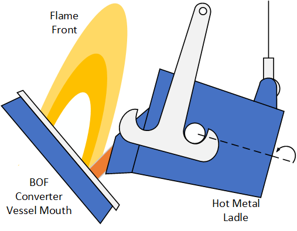

# Hot Metal Ladle Tracking


# Background
Pouring of hot metal into basic oxygen furnace vessels through hot metal ladles is a critical step that is carried out during the steelmaking process. It is typically performed manually by operators and is associated with challenges such as operational variability due to inconsistent human performance, harmful emissions due to the intense reactions occurring within the furnace, as well as equipment degradation which occurs due to said reactions impacting surrounding equipment. These challenges drive process optimisation which in the context of this case study, can be used to standardise the process, minimise emissions and extend the useful life of equipment.

The source code in this repository accompanies the research conducted as part of Case Study 1: Hot Metal Ladle Tracking.



# Acknowledgements

**Mask R-CNN**
Copyright (c) 2017 Matterport, Inc.
Licensed under the MIT License
Written by Waleed Abdulla


**Kalman filtering**
Rahmad Sadli

# Setup
## Anaconda environment
To replicate the anaconda environment used for this study:

 1. Clone the repository

 2. Set the current directory to Hot-Metal-Ladle-Tracking

 3. Execute the following command in Anaconda prompt:


	```conda env create -f mrcnn_environment.yml```


## Model Training

Once the environment is set up, set the current direction to 'Hot-Metal-Ladle-Tracking > Mask_RCNN > mrcnn' and execute:

```python ladle.py train --dataset=(insert dataset path) --weights=(insert weights path, or just use 'coco')```

to train the model.

## Inference

 - `load_video.py` is the inference script, and has been made from scratch
   (with Matterport acknowledged), and therefore is built to run from
   Spyder IDE.
   
 - `load_video2.py` is the inference script adapted for Kalman filtering.
 - **Paths** to the weights file and dataset folder are required for
   inference. They are already defined but will need adjustment for any future work.


# Example Results (currently blocked for confidentiality)

Example video outputs are included in this repository and are as follows:

 - **maskpool_7.mp4:** Mask R-CNN video segmentation
 
 - **maskpool_3_kalman.mp4:** Mask R-CNN + Kalman filtering video segmentation
 - **flameSeverity4.mp4:** Mask R-CNN video segmentation with pouring parameters and flame severity estimations

# Code Quality and Contribution Guidelines
The source code in this repository accompanies the research conducted as part of Case Study 1: Hot Metal Ladle Tracking. 

It is important to note that this project was initiated with a background in mechanical engineering rather than computer science or software engineering. 

Therefore, the focus is on application of these technologies rather than in software engineering principles. 

The code is shared for collaboration and contribution purposes, and whilst every effort has been made to ensure quality and readability, it may not adhere to all conventions of software development. 

This is particularly true for Case Study 1, which was conducted with limited coding experience and almost no computer vision experience.   

Feedback is welcome, with the understanding that the primary aim is to facilitate further research and application in the field, 
rather than to serve as a benchmark for software engineering excellence. 

# Publication

A paper has been published on this work in The International Journal of Advanced Manufacturing Technology (IJAMT), and is available at: [https://doi.org/10.1007/s00170-023-11151-4](https://doi.org/10.1007/s00170-023-11151-4)

```